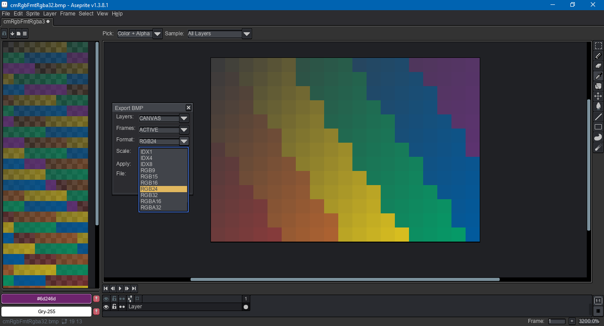

# Aseprite Bmp Export

This an [Aseprite](https://www.aseprite.org/) script to export `bmp`s in a variety of formats. Aseprite supports `bmp` export natively, but does not give the user direct control over the data format. This leads to problems where other graphics editors have issues opening Aseprite generated files.

This script uses the [BITMAPINFOHEADER](https://learn.microsoft.com/en-us/windows/win32/api/wingdi/ns-wingdi-bitmapinfoheader) for indexed 4 and 8 formats and RGB 15, 24 and 32 formats. It uses the [BITMAPV4HEADER](https://learn.microsoft.com/en-us/windows/win32/api/wingdi/ns-wingdi-bitmapv4header) for RGB 16 (565), RGBA 16 (5551) and RGBA 32 formats. Exported files do not use any compression. Color profile information is not written to the file, even when the `BITMAPV4HEADER` is used, as the data cannot be accessed by Aseprite's Lua scripting API. For that reason, the sRGB color space should be assumed.

Sample export files can be found in the samples folder if you'd like to test compatibility before using the script.

*This script was developed and tested in Aseprite version 1.3.7 on Windows 10.*

## Download

To download this script, click on the green Code button above, then select Download Zip. You can also click on the `bmpExport.lua` file. Beware that some browsers will append a `.txt` file format extension to script files on download. Aseprite will not recognize the script until this is removed and the original `.lua` extension is used. There can also be issues with copying and pasting. Be sure to click on the Raw file button. Do not copy the formatted code.

## Installation

To install this script, open Aseprite. In the menu bar, go to `File > Scripts > Open Scripts Folder`. Move the Lua script(s) into the folder that opens. Return to Aseprite; go to `File > Scripts > Rescan Scripts Folder`. The script should now be listed under `File > Scripts`. Select `bmpExport.lua` to launch the dialog.

If an error message in Aseprite's console appears, check if the script folder is on a file path that includes characters beyond ASCII, such as 'é' (e acute) or 'ö' (o umlaut).

## Usage

A hot key can be assigned to a script by going to `Edit > Keyboard Shortcuts`. The search input box in the top left of the shortcuts dialog can be used to locate the script by its file name.

Once open, holding down the `Alt` or `Option` key and pressing the underlined letter on a button will activate that button via keypress. For example, `Alt+C` will cancel the dialog.

## Compatibility

Below are known compatibility issues with exported gifs and other software.

|Software|IDX4|IDX8|RGB15|RGB16|RGB24|RGB32|RGBA16|RGBA32|
|--------|:--:|:--:|:---:|:---:|:---:|:---:|:----:|:----:|
|Aseprite|✔️|✔️|❕|✔️|✔️|❕|✔️|✔️|
|GIMP|✔️|✔️|✔️|✔️|✔️|✔️|✔️|✔️|
|Godot|❌|✔️|❕|✔️|✔️|❕|✔️|✔️|
|Irfanview|✔️|✔️|✔️|✔️|✔️|✔️|❕|❕|
|Krita|✔️|✔️|✔️|✔️|✔️|✔️|❕|✔️|
|MS Paint|✔️|✔️|✔️|✔️|✔️|✔️|❕|✔️|
|Paint.Net|✔️|✔️|✔️|✔️|✔️|✔️|❕|✔️|
|Unity|✔️|✔️|✔️|✔️|✔️|❕|❕|✔️|
|Visual Studio|✔️|✔️|✔️|✔️|✔️|✔️|❕|✔️|
|XnView MP|✔️|✔️|✔️|✔️|✔️|❕|❕|✔️|

The exclamation points indicate that a file will load, but there will be a transparency issue. In most cases, this is where the alpha channel is ignored. In some cases, the alpha channel is recognized in the file data, even if it's not specified by the header. The latter case is because this script writes the alpha to the file data for 15 and 32 bit RGB.

## Modification

If you would like to modify this script, Aseprite's scripting API documentation can be found [here](https://aseprite.org/api/). If you use [Visual Studio Code](https://code.visualstudio.com/), I recommend the [Lua Language Server](https://github.com/LuaLS/lua-language-server) extension along with an [Aseprite type definition](https://github.com/behreajj/aseprite-type-definition).